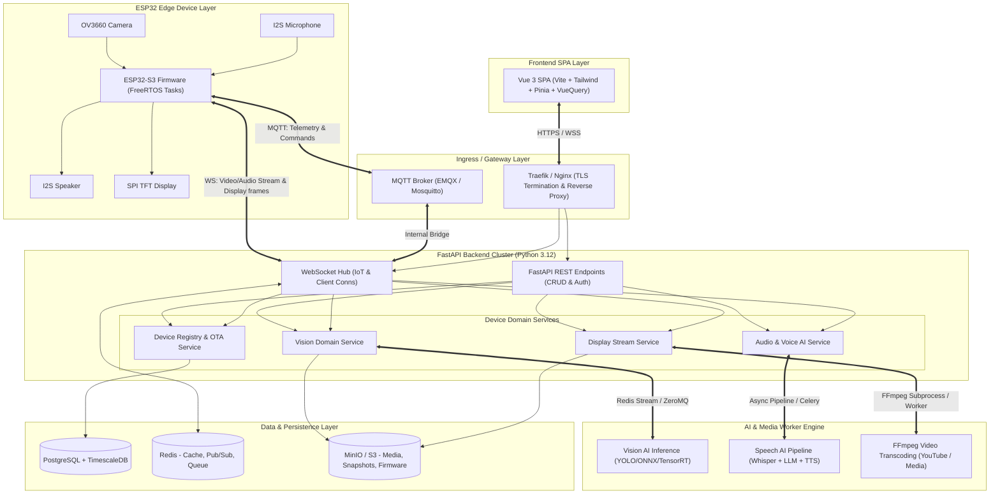
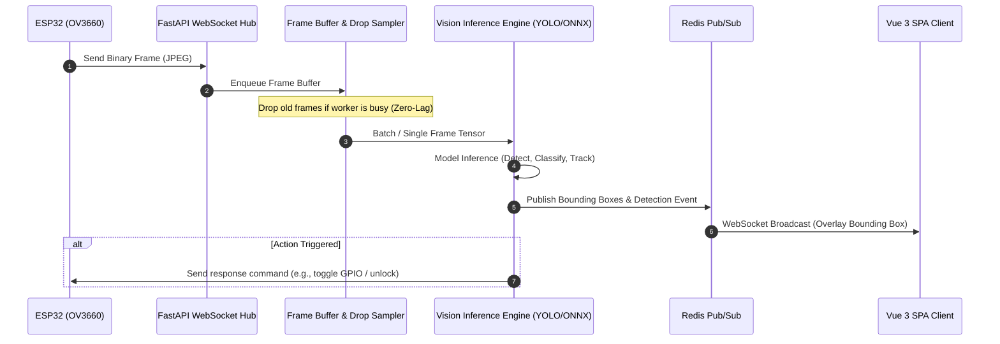
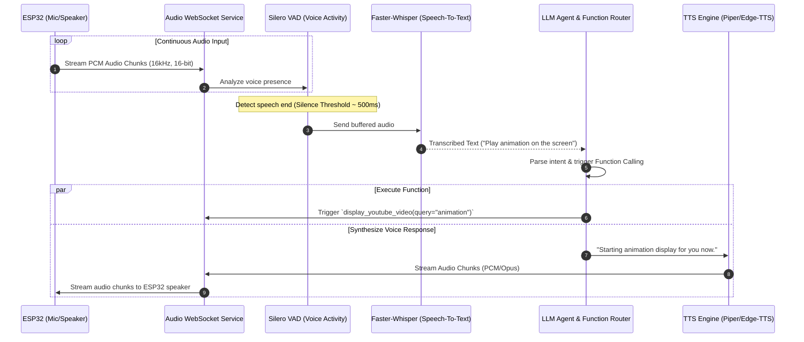
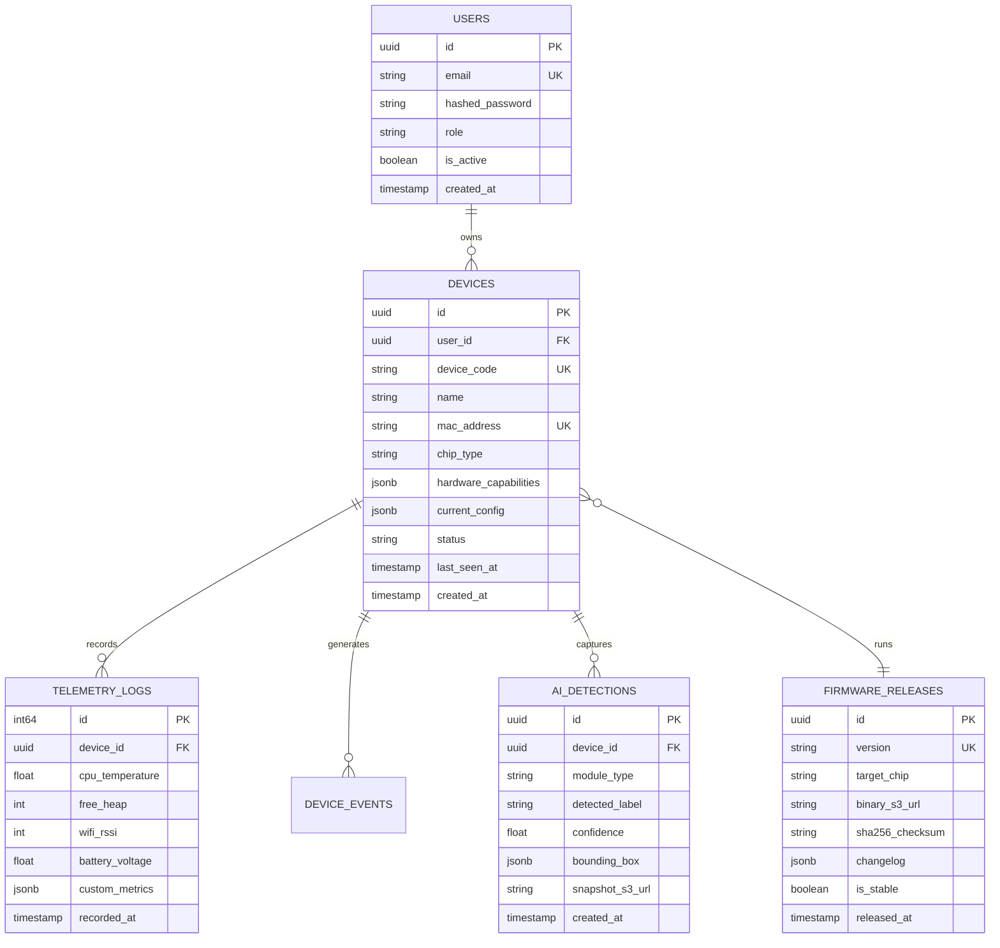

# SYSTEM ARCHITECTURE DESIGN
## PROJECT: SOLENE IOT SMART HUB & AI PLATFORM

---

## 1. END-TO-END TOPOLOGY OVERVIEW



---

## 2. COMMUNICATION PROTOCOLS MATRIX

To balance RAM constraints on the ESP32 and low latency requirements for AI, the system uses a hybrid protocol design:

| Communication Channel | Protocol | Payload Format | Usage Purpose |
| :--- | :--- | :--- | :--- |
| Telemetry & Heartbeat | MQTT v5 / TLS | Compact JSON / MsgPack | Transmit temperature, RAM, Wi-Fi RSSI, and receive GPIO trigger commands. |
| Camera Ingestion | WebSocket Binary / HTTP Chunked | JPEG Byte Array + Packet Header | Stream camera frames from OV3660 to backend for AI inference. |
| Voice Input / Output | WebSocket Full-Duplex | Raw PCM 16kHz 16-bit Mono (20ms-50ms Chunks) | Record user speech audio and stream back AI synthesized speech response. |
| Display Streaming | WebSocket Binary / TCP Stream | MJPEG / RGB565 Chunks (Header + Pixel Array) | Stream transcoded video frames down to the ESP32 display. |
| Firmware OTA | HTTPS (Range requests) | Binary file (`.bin`) | Download firmware binary with SHA-256 validation. |
| Web Client SPA | REST API + WebSockets | JSON + WebRTC / WSS | System administration, configuration, and live stream viewing. |

---

## 3. AI & MEDIA PIPELINE DESIGNS

### 3.1. Vision & Deep Learning Pipeline



### 3.2. Conversational Audio & Voice AI Pipeline



### 3.3. YouTube Transcoding & Display Pipeline

```mermaid
flowchart LR
    UserRequest["Request: YouTube Link"] --> Fetcher["yt-dlp Stream Extractor"]
    Fetcher --> FFmpeg["FFmpeg Transcoder Engine"]
    
    subgraph TranscodeConfig["ESP32 Optimization"]
        FFmpeg --> Scale["Resize: 320x240 / 240x240"]
        Scale --> FPS["Downsample: 15-20 FPS"]
        FPS --> Format["Format: MJPEG or RGB565 Stream"]
    end
    
    Format --> StreamQueue["Async Frame Queue"]
    StreamQueue --> WS_Display["FastAPI Display Service"]
    WS_Display ==> "Binary WebSocket" ==> ESP_Disp["ESP32 DMA Frame Buffer -> TFT Screen"]
```

---

## 4. DATABASE ERD SCHEMA

The platform uses PostgreSQL 16 with TimescaleDB support for telemetry:


